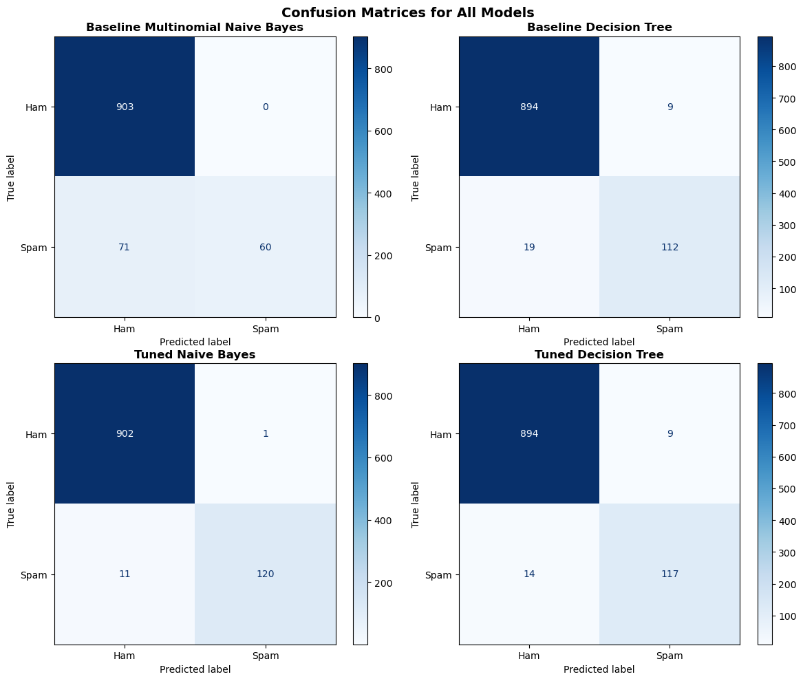
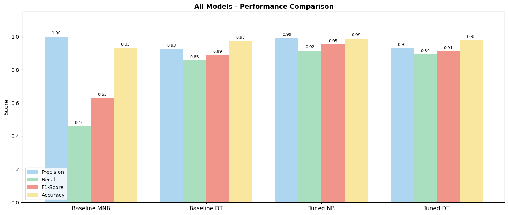
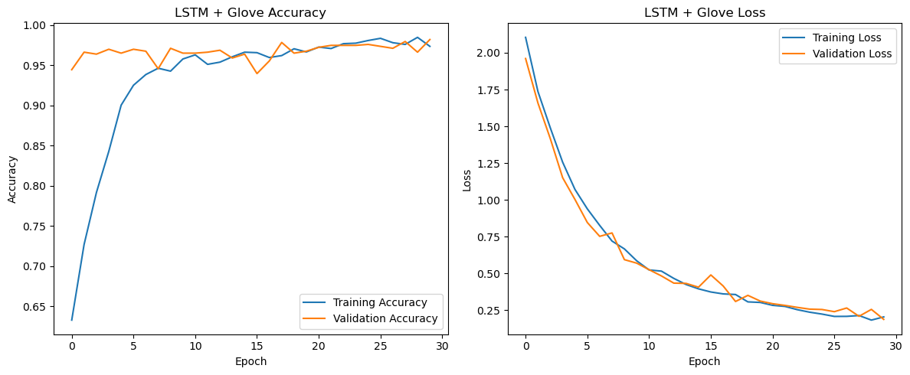
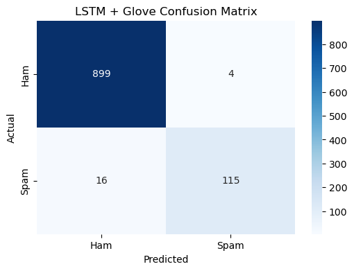
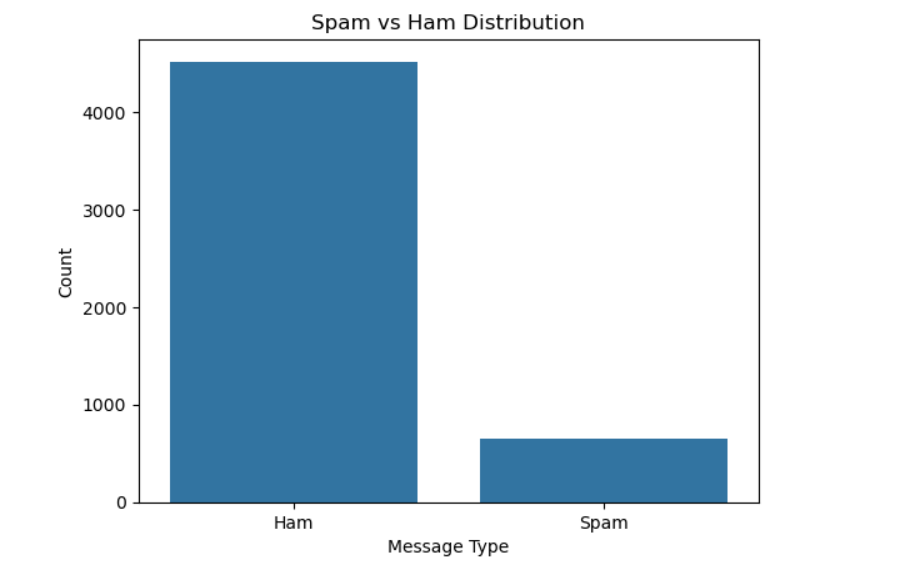
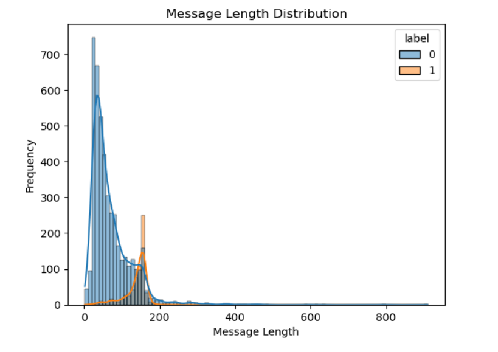
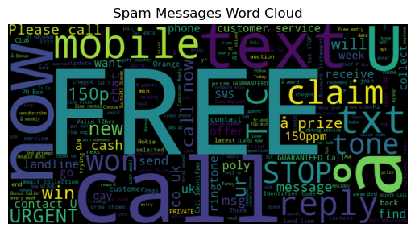

# SMS Spam Classification

NLP spam detection comparing traditional machine learning with recurrent neural networks on the UCI SMS Spam Collection.

The project combines TF-IDF text features, handcrafted message features and class-imbalance handling, then compares Multinomial Naive Bayes and Decision Tree models with SimpleRNN and LSTM approaches.

## Key Results

| Model | Accuracy | Precision | Recall | F1 |
|---|---:|---:|---:|---:|
| Tuned Multinomial Naive Bayes | **0.99** | **0.99** | **0.92** | **0.95** |
| LSTM + GloVe | 0.98 | 0.97 | 0.88 | 0.92 |
| Tuned Decision Tree | 0.98 | 0.93 | 0.89 | 0.91 |
| Baseline LSTM | 0.98 | 0.90 | 0.92 | 0.91 |
| Baseline RNN | 0.97 | 0.96 | 0.82 | 0.89 |
| Baseline Naive Bayes | 0.93 | 1.00 | 0.46 | 0.63 |

The strongest model was the tuned Multinomial Naive Bayes classifier, achieving an **F1 score of 0.95**. The large improvement over the baseline model shows the importance of imbalance handling and feature engineering for minority-class spam detection.

## Dataset

The project uses the **UCI SMS Spam Collection** containing 5,572 labelled SMS messages:

- 4,825 ham messages
- 747 spam messages
- 13.41% spam

After removing 403 duplicate messages, 5,169 observations were retained for modelling.

## Methodology

### Traditional Machine Learning

The traditional ML workflow combines:

- TF-IDF text representation
- unigram, bigram and trigram features
- handcrafted SMS characteristics
- SMOTE for class imbalance
- Multinomial Naive Bayes
- Decision Tree
- GridSearchCV with 5-fold cross-validation
- F1 score as the main optimisation metric

Handcrafted features include message length, digit count, URL presence, occurrence of `call`, word count and message-length thresholds.

### Deep Learning

The deep-learning workflow compares:

- SimpleRNN
- LSTM
- pretrained 100-dimensional GloVe embeddings
- class weighting
- dropout and regularisation
- early stopping

Text sequences use a vocabulary size of 5,000 and a maximum sequence length of 100 tokens.

## Results

### Traditional Machine Learning





### LSTM + GloVe





### Exploratory Analysis







## Project Structure

```text
sms-spam-classification/
├── data/
│   ├── README.md
│   ├── raw/
│   │   └── sms_spam.csv
│   └── processed/
│       └── sms_spam_processed.csv
├── results/
├── scripts/
│   ├── 01_data_preparation_eda.py
│   ├── 02_machine_learning.py
│   └── 03_deep_learning.py
├── src/
│   ├── __init__.py
│   ├── preprocessing.py
│   ├── feature_engineering.py
│   ├── machine_learning.py
│   └── deep_learning.py
├── .gitignore
├── LICENSE
├── README.md
└── requirements.txt
```

## Technologies

Python · pandas · NumPy · scikit-learn · imbalanced-learn · TensorFlow/Keras · TF-IDF · SMOTE · RNN · LSTM · GloVe · Matplotlib · Seaborn

## Running the Project

Install the dependencies:

```bash
pip install -r requirements.txt
```

Prepare the data and generate exploratory figures:

```bash
python scripts/01_data_preparation_eda.py
```

Run the traditional machine-learning models:

```bash
python scripts/02_machine_learning.py
```

Run the deep-learning experiments:

```bash
python scripts/03_deep_learning.py
```

The LSTM + GloVe experiment requires the `glove.6B.100d.txt` embeddings file under `data/embeddings/`.

## Main Finding

For this relatively small short-text dataset, a carefully engineered traditional NLP pipeline outperformed the more computationally complex recurrent neural networks. The tuned Multinomial Naive Bayes model achieved the strongest overall F1 score while remaining comparatively lightweight.
